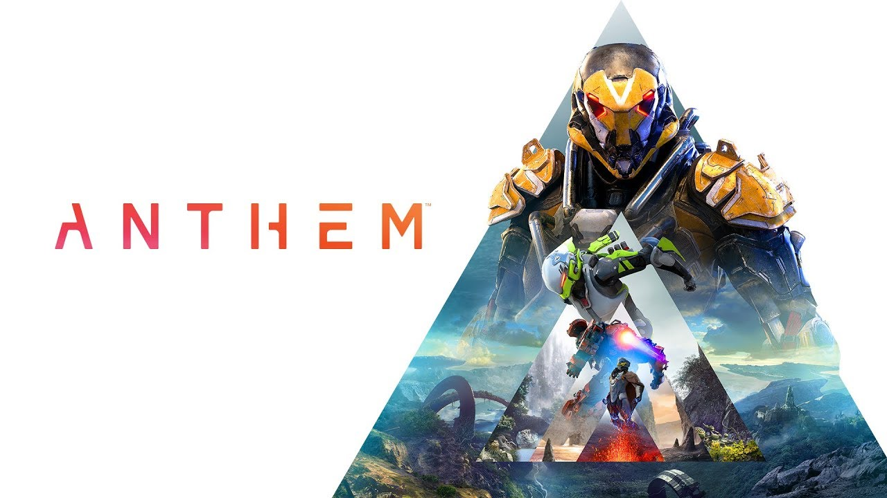

OK, so picture this. You are in an "unfinished world", where humanity is up against gigantic creatures and monsters capable of eating humans in one scoop. You are a Freelancer, a person who dedicates themselves to exploring the world outside of the safety of your home, and find out baout its mysteries. You also set out to fight against ***The Dominion***, a group bent on finding the Anthem, an item left behind by the gods that harnesses the raw power of creation itself, and using it to create and destroy at will. You, as a Freelancer, are tasked with the grand mission of preventing *The Dominion* from obtaining it, ultimately helping humanity to survive on the harsh planet.

This is the premise of the game **Anthem**, which is being developed by **BioWare** and published by **EA**. And before everyone gets out their torches and pitchforks out because I mentioned **EA**, let me explain. 

Last weekend, BioWare and EA released a beta which was available only to people who preordered the game. As soon as the game went live, there were reports of "infinite load times" along with poorly scaled enemy encounters. And while those were fixed by then end of the play test, it left a lot of people with a sour taste in their motuh. Those who didn't experience these issues however, cited the looter shooter feel that is present in this game and how its similar in feel to its competition **Destiny**, a game developed by and [recently in the publishing hands][Bungie Split] of **Bungie**. People mentioned how there were a lot of familiar details and that it felt less of a grind in terms of gameplay and more generous weapon drops.

Fast forward to this weekend, and players eager to try the game but who didn't preorder *FINALLY* get a shot to try the game out, myself included. And dare I say, it was a fairly suprising experience.

First, a bit about the gameplay basics. In the Anthem Demo, you started at level 10, and could progress up to level 15. By this point, everyone was given access access to the Ranger-type Javelin (basically mech suit), with the ability of gaining a new Javelin about mid way at level 13. The Ragner Javelin was one of the more versitle armors, balanced in both offense and mobility. The second Javelin I got to use (from a list of 3 that I could potentially unlock, making 4 suits total) was the Storm. This suit was more focused on AoE attacks and using magic rather than traditional firepower. 

So what made this so good for me? Well, it all comes down to how things were balanced. It seems that, at least for the demo, the damage output between how much you had to use your guns vs. how often you could use the abilities your javelins provided was pretty much 50/50. This made it so that, while you don't necessarily have to keep track of a timer for too long, when you were able to actually use your ability, it felt powerful and helped you take down those annoying enemies.

Next, let's dive into the dialogue choices a little bit, because these are kind of concerning. In the demo, you are presented with a vertical slice of story that doesn't reveal much of the story beyond what has already been revealed. But the dialogue options when interracting with NPCs are a bit sparse, limited to either a good guy option (one that expesses praise/admiration), and a moderate but still kind of respectable option that isn't too far deviated from the first. And this is one of my major problems. This is going to be like a repeat for **Fallout 4**, a game which suffered with just such a problem, among other things, and lead to very harsh reviews and criticisms. This is not what I would want for Anthem.

The story is up next, and while admitedly the vertical slice didn't give too much away, and I admittedly didn't pay too much attention during the demo, there is still something to talk about when it comes to story. As I mentioned earlier, dialogue options are sparse and seem kind of uninspired. However, that isn't to say that their world building and overall narrative is uninspired as well. On the contrary, this game is set to be a prime example of narrative delivered really well, being a mix of interactive story telling via missions, as well as through NPC interactions. If it wasn't for the poor dialogue choices between you and NPCs, I would say this would be in line with **Destiny** storytelling; rich world building, a narrative filled with mysticism and intrigue, just ready to be explored.

Anthem is a game that is a looter-shooter trying to take everything good about the genre, and adding an intermingled story, and pretty solid movement mechanics. Things like dialogue interactions and narrative handling in general shouldn't get in the way of how this game performs. Ideally, I would like to see **Respawn** iron that stuff out and maintain that balance.

The biggest downside to ALL OF THIS? The publisher. **EA** has been known to hurt its own IPs and stomp on good titles, most recently with microtransactions, for YEARS. Titles like *The Sims*, *Mass Effect* (and particularly the last entry in said series), and the *Star Wars Battlefront* games have all suffered immensely because of the poor handling of this company. The [recent controversies with the handling of the Star Wars license in particular][EA Star Wars License] have given me very little hope for this games survival. The potential is there, but because of the publisher's history, I can only really see a rocky path ahead, and a very short life if they don't sell well.

Anthem should be set to be a great game, and without a doubt, it will be a spectacular experience for both veterans of the looter-shooter genre of games and those who maybe want to delv into it for the first time. ONly time will really tell tho, how long this will last. We will just have to wait and see what **EA** would be willing to do with this fledgling IP, because we can only really fear the worst. And that, is what disappoints me the most.

***EDIT***: *Added last paragraph and fixed grammar issues Feb 6, 2019 - 11:36 PM*

[Bungie Split]: https://kotaku.com/bungie-splits-with-activision-1831651740
[EA Star Wars License]: https://www.forbes.com/sites/insertcoin/2019/01/16/ea-is-squandering-disneys-priceless-star-wars-license/