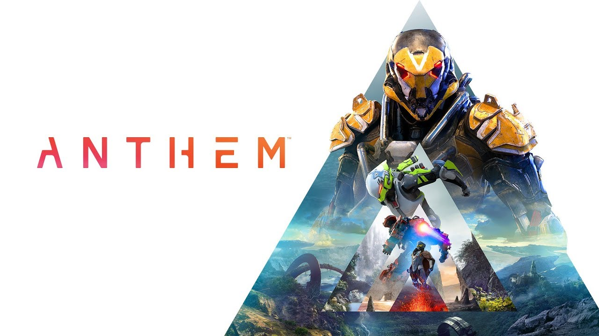

Well, we are back again, with a full review of the game **Anthem**, a game [I had previously taken a look at the demo for][Previous Review], and had a very good initial inpression of. Now, with the full release available to everyone today, and me having played it for a couple of days via **EA**'s [Origin Access][Origin Access] program, I will now give me final thoughts on the game that I had high hopes for, but soon realized that it needs MORE work than I had initially imagined. 

## Basics and Gameplay
As I said before in my last foray into the game, this is honestly a pretty smooth experience for me. The flight mechanic is still amazing to use, combat still feels powerful and rewarding, and quests have been pretty interesting for me, with a world that feels mysterious. The abilities feel very effective, as I mentioned before, and although the focus isn't entirely on the gunply, it still sounds very satisfying despite feeling very clunky to use the weapons in the game. Bearing all this in mind, I still rather enjoy the gameplay and would say it is off to an amazing start.

## Story
Now we get into the disappointing part of the game: the story. Now, before I get too deep into this, I just want to point out that it is **NOT** a terrible story. In fact, I think this could potentially be a really good story over time. That being the case tho, I find that they could have done SOO much more with a lot of details and character interactions. As I mentioned in my past review of the demo version, the dialogue options left people with a lot to be desired, as the choices for interacting with NPCs seemed a little too uninspired. Sadly, this still holds trueof the full release of the game. The dialogue options still seem kind of uninspired and don't really do much to indicate where the plot is moving, and show very little personality in your character.

## Microtransactions
This one is kind of hard for me to discern, as we have yet to see a major change with this aspect of the game. And let me get it out of the way now: yes, there are Microtransaction in Anthem. And while I would have preferred that there weren't any, I think that the way they have handled them, a WYSIWYG (**W**hat **Y**ou **S**ee **I**s **W**hat **Y**ou **G**et) model, it honestly doesn't look too bad. Combine that with the fact that most of the items in the store are cosmetic in nature (different materials or armor pieces for changing the look of your suit, none of which affect power in game), and you have a pretty good system for them to create a way to monetise their content without affecting the in-game power balance inf favor of those making said purchases.

## Technical Aspects
On the tehnical aspect, there is a mixed bag of sorts. Some report sever bugs such as not having updated loadouts, audio glitches, interface items disappearing, among others. I personally did not experience much of this, but I know several people have reported as such, so its very hit or miss.

This makes it very much a gamble for people looking to play it, because even with more than the required specs to be able to play the game at max **Ultra** Settings, the risk of running into audio and graphical issues is still pretty high. This is definitely something to keep in mind, as that may make or break a purchase for some.
## Looking Forward
So the game is off to a pretty rough start, and that is putting it mildly. This is a game that has LOTS of potential and room to grow, but is currently between a rock and a hard place with both its technical and content problems. That being said, there is a lot of home coming from  **BioWare** as [they work towards dropping more content and patches for common issues in the coming months.][Anthem Roadmap] This set of changes are very hopeful, and display a commitment to the game that is rock solid. It is also worth bearing in mind that multipplayer First-Person looter-shooters as a genre have NEVER launched in a perfect state, so this seems pretty par for the course at this point. Nad honsetly, the only way to prove that this game can stand on its own is to show us what its got in the content and end-game department. Only time will tell, but for now, I would honestly consider just waiting it out if you have not purchased the game already, as in its current state, your mileage may vary in terms of experience.

If you have any comments on this article, any I've written in the past, suggestions for future articles, or just want to chat, I can be reached on Twitter with the link at the footer.

[Previous Review]:https://mexdaves-opinion.netlify.com/Anthem_Demo/ 
[Origin Acces]:https://www.origin.com/usa/en-us/store/origin-access
[Anthem Roadmap]: https://www.pcgamer.com/anthem-roadmap/
