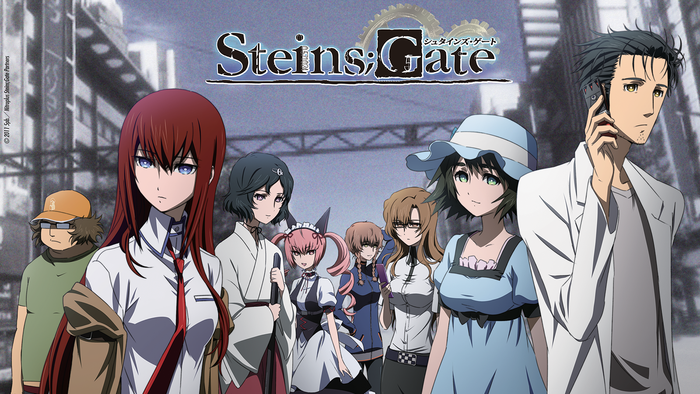

Well, here we are. Review two! For this review, I will talk about a series that I have been hooked on for a good couple months now. The show, called Stein's;Gate, is part of a larger Sci-Adv universe, which explores conspiracy theories and the science behind it. This series in particular talks about the science of time-travel and the John Titor conspiracy.

# Story
Where to start? The story is a wild ride. This is another series based off a visual novel, which also has quite a few endings. However, for the case of succinctness, we will stick to the show's timeline, as the events in the anime are fairly easy to go over.

The anime starts by introducing the series two main characters, Okabe Rintarou and Mayuri Shina. The year is 2010, Okabe is a young university student, and childhood friend to high school student Mayuri. The story begins with a lecture on time travel, and Okabe vehemently pointing out similarities to theories brought up by John Titor, a man who mysteriously appeared on US forums in the year 2000.

As the show progresses, we see them meet Makise Kurisu, a genius scientist who, with the help of Okabe's original inventions, manages to build a time machine. The rest of the series is littered with the exploits of these 3 main characters, and the perils involved with manipulating time.

## Overall Impressions
The story, while discussing conspiracy theories and theoretical sciences, displays them in a very believable fashion. The explanations are succinct and informative, and don't stray too far from the main plot points of the series. The plot, while displaying potential for branching points, doe a good job of being fairly linear until the end.

# Character Development
In this series, you see the development of 2 main characters: Okabe and Kurisu. They each have their own ambitions and goals, and don't really see eye to eye at first, but they then realize the respect they have for each other.

## Okabe Rintarou
Okabe was a man with ambition. A drive to prove that he was a "mad scientist". He does this for the sake of Mayuri, and he eventually encapsulates that persona, calling himself "Houhin Kyouma". This persona slowly breaks apart at the end, however. This persona is stripped the more he is involved with the time machine, and the more he sees the suffering of Mayuri.

This is also combined with his eventual love for Makise. To him, she is initially a nuisance, foiling his plans and being a nuisance. As the series goes on, however, he grows to accept her, first as an assistant giving her the nicknames "Christina" and "zombie", and later he decided that she was his equal.

By the end of the show, he had developed a deep love for her, going so far as to question his loyalty to Mayuri for it. Ultimately however, he i forced to make the decision, and he chooses to save his childhood friend at the cost of his love. This brings about a bout of despair in Okabe, to the point of him completely dissolving his demeanor and persona.

## Makise Kurisu
With a genius level intellect, Makise Kurisu is the one person around which the series pivots. She was initially introduced as a shy, but level headed character who would always like to take control of a situation. As the show progresses however, we get to see more of Kurisu's nature. We learn that she is as much of an otaku and internet nerd as Daru (one of Okabe's friends also involved in this craze), and has some tsundere-like traits when flustered.

Moving forward, her feelings towards Okabe grows stronger. At first, she found him to be a nuisance, almost like a child. She then comes to learn of his goals, his determination and will to push ahead and do things for the sake of others, like how he was trying to change the past for the sake of saving Mayuri. The feelings of affection confuse her at first, and she refuses to admit it at first, but then comes to learn that its ok to love, and embraces him to the end.

# Themes
There are very few series, in my experience, that have as large an impact as Stein's;Gate. The largest theme discusses the state of the human condition, and its position in the world. The main discussion around time travel also addresses the question of what humans are capable of achieving. In the case of Okabe and Kurisu, they had the power to change whole timelines, to reverse mistakes made by their peers. An yet, they discovered a plethora of other things that go wrong as a result, and Okabe truly understands that this power is one that humans shouldn't be too careless with.

Furthermore, the idea of what it means to lose someone dear is explored, and its overall impact of who you become. For the case of Okabe, he has to make a choice of who to lose: the childhood friend, or the girl he came to love. And while in the end he chose the former, it wasn't without realizing that he had to lose something to gain something else. In his case, it was either losing Mayuri in exchange for Kurisu, or vice versa. To him, there was no escaping the loss.

# Final Thoughts
For me, this series is a definite must watch. It is full of adventure, science, and topped with a tragic love story that is beautifully displayed. The how encompasses the question of "What if human kind were to discover time travel now? What would we do with it?". What we get is a beautifully orchestrated masterpiece of a show that, while at first glance seems to be just another shounen, turns out to be a really well developed how about the dangers of time travel and the struggles of love and loss.