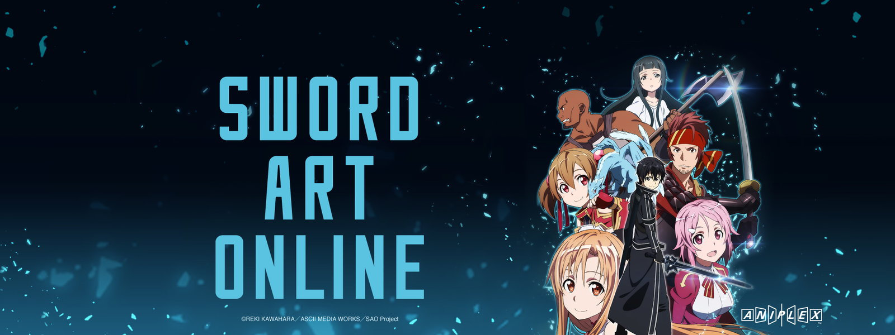

For me, college was a very interesting venture.
At 17, I was a college freshman, majoring in Sociology, and was prepared to take on anything that came my way.
However, life got in the way, and it stopped me in my tracks. I was, for a lack of a better term, stuck. 
I jumped into the workforce, and remember the work I had to put in to keep up with my expenses, and that provided me with a larger world, one filled with lots of miscellaneous challenges.
It's been 4 years since then, and the world has given me a new resaon to jump back on the horse, and to pursue higher education again.
All these events were eye-opening, providing me with an even larger understanding of the world around me, and a bigger appreciation for the little details in life.
Things like appreciating time with family and friends, dedicating time to find myself, and really accepting the flaws in the world and running with them.

Such was my foray into the world of anime. A vast world that I had been introduced to at a relatively early age (***Dragonball Z***, ***Pokemon***, and/or ***Yugioh***, anyone?), but I had had no real clue that they were anime until I was well into my high school career. My first true foray into the world of anime, geared with the knowledge that it was such, is ***Sword Art Online***. This is a show that I remember with a fondness, as it was my gateway into a larger world of anime. A world where the only limits to what exist is really what you can imagine. 