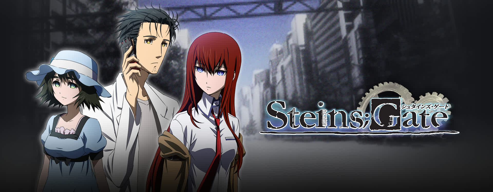
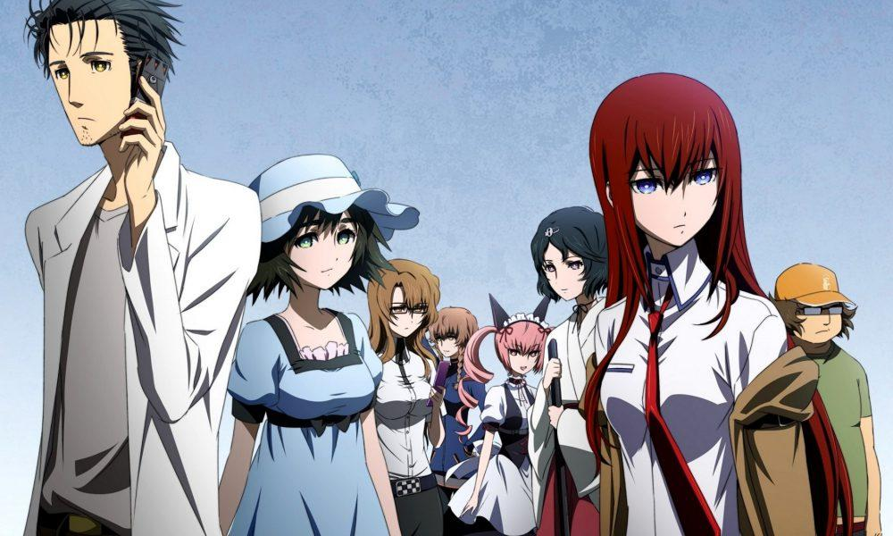

***Steins;Gate*** is a story unlike any other. It is one filled with several twists and turns, where actions have genuine consequences, and the basis of all the events are grounded in real life thoretical physics concepts. And these things have definitely made me love the show even more.

## Story
***Steins;Gate*** is a show that explores time travel and theoretical physics in a way that feels fresh and interesting. The show delves into the overview and explains it in a way that leaves you interested. This, mixed in with just a bi of fantastical events (the actual existence of trime tavel and the idea that it can very well happen is still not something scientists are willing to try), and you have a story that is packed with all kinds of possiblities. 

Take the visual Novel, for instance. The original source material has a myriad of options for you to explore, with its sequel series ***Steins;Gate Zero*** has an even broader list of possible routes the story can take. And the anime does a pretty good job of illustrating a lot of the more nuanced routes, outlining the many possibilities the story could have taken.  

## Characters

This is another facet that I really enjoy. Unlike most other shows that have complex characters but don't take the time to really flesh them out, ***Steins;Gate*** does this from the outset. The characters seem more alive in that regard; they each have their own motivations to pursue time travel, and each have a desire of the technology. And while some are more admirable than others, they all have the common bond of time travel as a solution to their problem. They have enough depth by themselves that you an imagine a storyline with the them and Okabe living a happy life. And that for me is amazing. The level of storytelling needed to pull that kind of thing off is remarkably impressive to me; not very many shows can pull that kind of thing off and get away with it.

## Animation
This is also a very well done aspect of the show, and props to the animation team at **White Fox**, who did a remarkable job at recreating the world. Everything from the background scenes, to facial expressions, to the few action scenes that are present in the show. Everything has a distinct gary tinge, and looks familiar when compared to the VN source material. This is something that I can truly appreciate; the amount of detail they are willing to put into the animation details is very respectable and makes watching it a lot more compalling, especially for people who have seen the source material prior to picking it up.

## Content
My favorite thing about this series, above all else, is the content this show presents. It is an eclectic mix of real-life sciences combined with pretty fantastical, larger-than-life, yet still understandable situations. This makes the story, at least for me, very relateable and relatively easy to follow; there aren't many thing different from our world that we need to necessarily keep track of, and the story is grounded in roots that can be researched.

In the case of ***Steins;Gate***, this root comes in the form of its usage of theoretical physics concepts and time travel theories. While the idea of time travel itself being possible isn't real, the theorems behind them do. All the theorems discussed in the show are all real-life theoretical physics concepts that can be researched and learned more about. As a science fan, I enjoy being able to tie something like this to a more tangible theory or concept that isn't filled with overly cliche sci-fi tropes (pretty sure you all know what I'm talking about).

## End Thoughts
***Steins;Gate***, for me, is a show that does a lot of things right. Its nice blend, of rich, beoeveable story, with larger than life elements, and well-developed characters are all reasons I never tire of watching this show. It appeals to a lot of my interests (science, and romance being my two favorite genres). In my eyes, this show is one that will always remain as my favorite, along side ***Sword Art Online*** and ***Your Lie in April*** (both of which I plan to write proper reviews for at a later date). If anone has any comments on this article, any I've written in the past, sugestions for future articles, or just want to chat, I can be reached [on Tiwtter at @MEXdave_gaming](https://twitter.com/MEXdave_gaming).